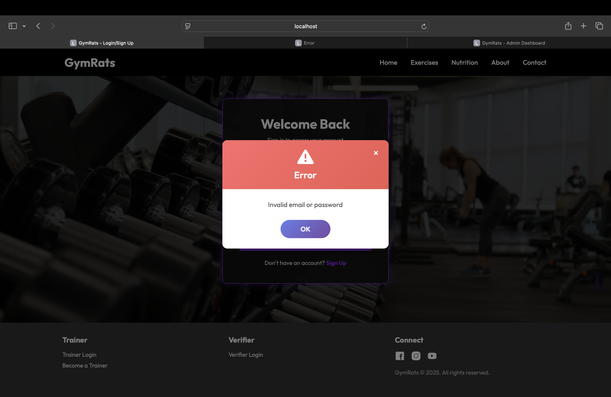
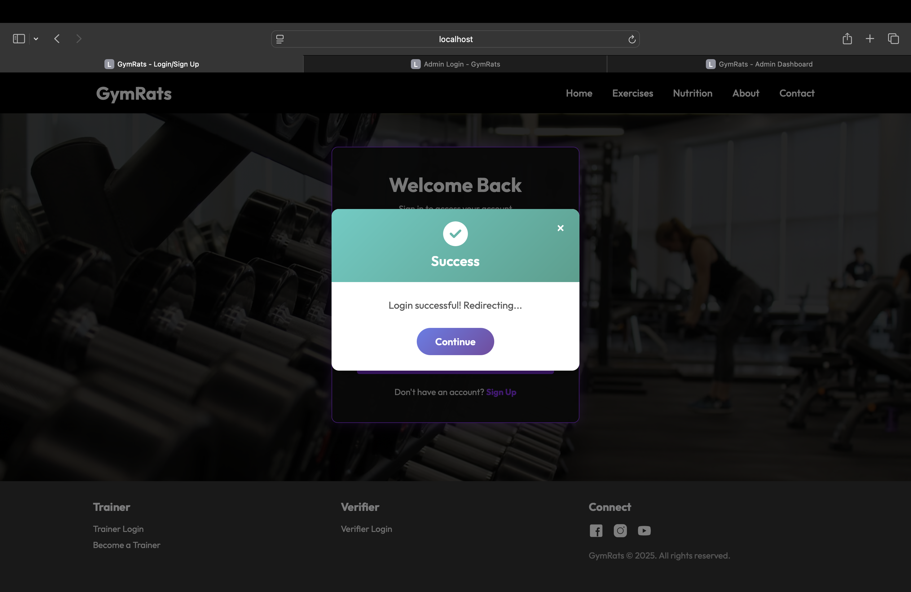
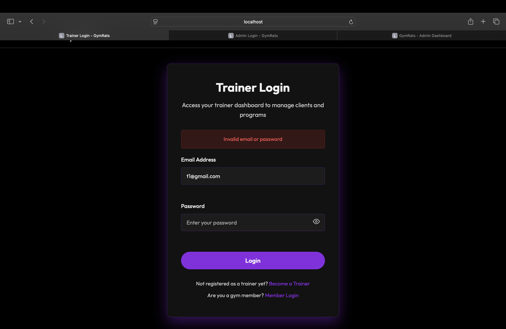
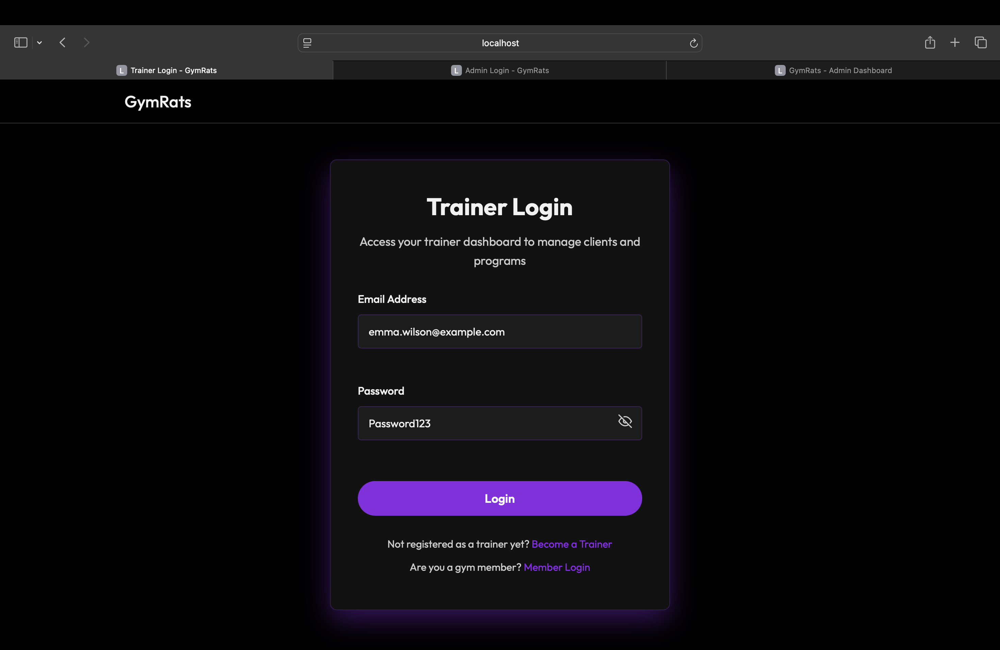
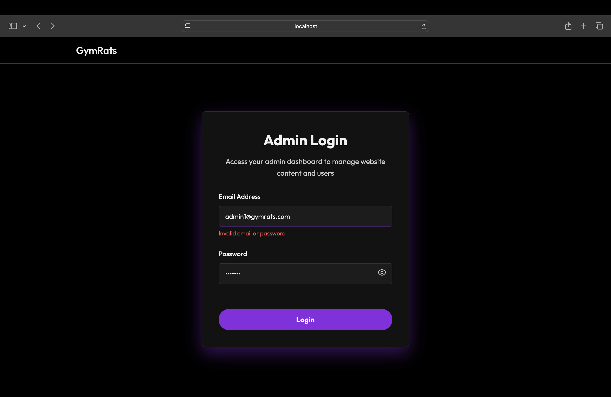
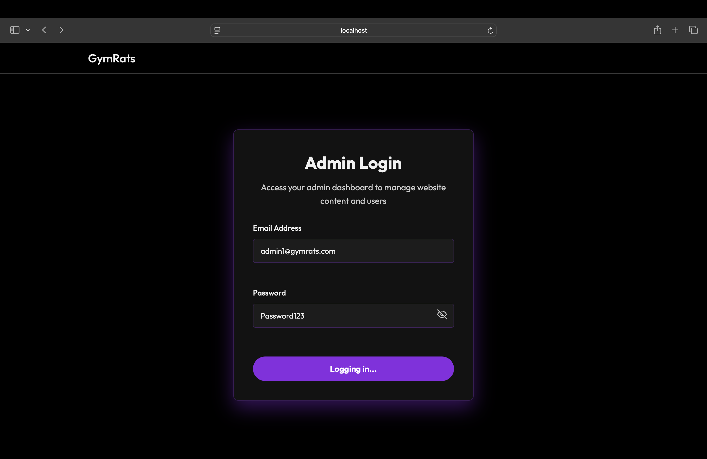

## 1. User Sign In Test Cases 

 | Case | Input | Expected Result | Actual Result | Status | Screenshot | 

 | :--- | :--- | :--- | :--- | :--- | :--- | 

 | **Invalid** | `Email: abc@example.com`, `Password: 123456` | Error message: "Invalid email or password". | A red banner with the text "Invalid email or password" is displayed. | Passed |  | 

 | **Valid** | `Email: dexter@gmail.com`, `Password: Password123` | User successfully authenticated. | A green banner with "Login successful" is displayed. | Passed |  | 

 --- 

 ## 2. Trainer sign in Test Cases 

 | Case | Input | Expected Result | Actual Result | Status | Screenshot | 

 | :--- | :--- | :--- | :--- | :--- | :--- | 

  **Invalid** | `Email: trainer@example.com`, `Password: 123456` | Error message: "Invalid email or password". | A red banner with the text "Invalid email or password" is displayed. | Passed |  | 

 | **Valid** | `Email: emma.wilson@example.com`, `Password: Password123` | User successfully authenticated. | details are displayed. | Passed |  | 

 --- 

 ## 3. Verifier Sign in Test Cases 

 | Case | Input | Expected Result | Actual Result | Status | Screenshot | 

 | :--- | :--- | :--- | :--- | :--- | :--- | 

 | **Invalid** | `Email: verifier@example.com`, `Password: 123456` | Error message: "Invalid email or password". | A red banner with the text "Invalid email or password" is displayed. | Passed |  | 

 | **Valid** | `Email: vivek@gmail.com`, `Password: Password123` | User successfully authenticated. | A green banner with "Login successful" is displayed. | Passed |  | 

 --- 

 ## 4. Admin Sign in Test Cases 

 | Case | Input | Expected Result | Actual Result | Status | Screenshot | 

 | :--- | :--- | :--- | :--- | :--- | :--- | 

 | **Invalid** | `Email: admin@example.com`, `Password: 123456` | Error message: "Invalid email or password". | A red banner with the text "Invalid email or password" is displayed. | Passed |  | 

 | **Valid** | `Email: admin1@gymrats.com`, `Password: Password123` | User successfully authenticated. | A green banner with "Login successful" is displayed. | Passed |  | 

 ---

